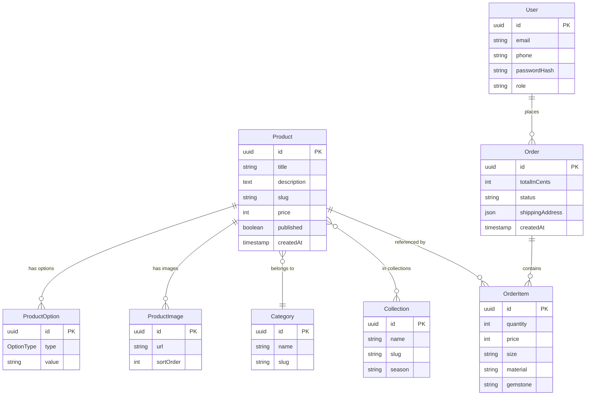
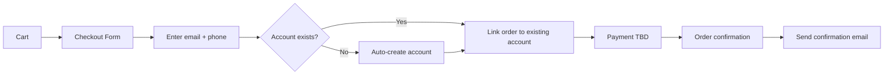

# Stan — Jewelry Store Website Requirements

## 1. Project Overview

**Stan** is a modern minimalist e-commerce website for a jewelry store. Customers can browse collections, view product details with configurable options (size, material, gemstone), and purchase online. An admin panel allows store owners to manage pricing, options, and photos. Accounts are created automatically at checkout for marketing purposes.

---

## 2. Brand & Design Direction

- **Aesthetic:** Modern minimalist — clean white backgrounds, generous whitespace, subtle serif/sans-serif typography pairing
- **Color palette:** Neutral base (white, off-white, light gray) with muted accent (soft gold or champagne for CTAs and highlights)
- **Photography style:** Product-focused, airy, high-contrast on white/light backgrounds
- **Typography:** Elegant serif for headings (e.g., Cormorant Garamond), clean sans-serif for body (e.g., Inter)

---

## 3. Recommended Tech Stack

- **Framework:** Next.js 15 (App Router) + TypeScript — SSR/SSG for SEO, API routes for backend, single codebase
- **Styling:** Tailwind CSS + shadcn/ui — rapid minimalist UI, accessible component primitives
- **Database:** PostgreSQL — relational data (products, orders, users, options)
- **ORM:** Prisma — type-safe queries, migrations, schema-as-code
- **File storage:** Cloudinary or AWS S3 — product image hosting and optimization
- **Auth:** NextAuth.js (Auth.js v5) — session management, auto-account creation at checkout
- **Payments:** TBD (Stripe recommended) — architecture will be payment-provider agnostic
- **Deployment:** TBD (Vercel, Railway, or VPS) — Next.js deploys natively to Vercel; Railway/VPS for full control

---

## 4. Information Architecture & Pages

### 4.1 Storefront (Public)

- **Home** — Hero banner (rotating collections), featured products, "Shop by Collection" grid, brand statement
- **Shop** — Filterable product grid; filter by category (Necklaces, Bracelets), collection (Summer, Winter, Special, etc.), price range, material; sort by price/newest
- **Product Detail** — Image gallery, option selectors (size, material, gemstone), price, add-to-cart, related products
- **Contact** — Contact form (name, email, message), store address / map embed, social links
- **Cart** — Slide-out or dedicated cart page with line items, quantity controls, subtotal
- **Checkout** — Shipping info, payment (TBD), order summary; auto-creates account with email + phone

### 4.2 Customer Account (Authenticated)

- **Order History** — List of past orders with status
- **Account Settings** — Update email, phone, password, shipping address

### 4.3 Admin Panel (`/admin`)

- **Dashboard** — Overview stats (total orders, revenue, low-stock alerts)
- **Products** — CRUD for products: title, description, price, images (multi-upload), category, collection, options (size, material, gemstone)
- **Collections** — CRUD for collections (Summer, Winter, Special, custom)
- **Categories** — Manage categories (Necklaces, Bracelets, future additions)
- **Orders** — View orders, update fulfillment status, customer details
- **Customers** — List of customer accounts, contact info

---

## 5. Data Model (Core Entities)

---

## 6. Product Options Model

Each product has a single price and can have independently configurable options of three types:

- **Size** (e.g., 6, 7, 8 for rings; 16in, 18in for necklaces)
- **Material** (e.g., Gold, Silver, Rose Gold)
- **Gemstone** (e.g., Diamond, Emerald, None)

Options are independent — they are not bundled into variant combinations. Price does not vary by option selection. If a product exists in the system it is considered in stock.

---

## 7. Checkout & Account Creation Flow

- No login required to shop or check out
- Account is silently created at checkout using email + phone
- Customer receives a "set your password" email to access order history later

---

## 8. Admin Panel Functionality

- **Authentication:** Admin users log in with email + password; `role: "admin"` on User model
- **Product management:** Create/edit/delete products, upload multiple images with drag-and-drop reordering, manage options (size, material, gemstone) inline
- **Collection management:** Create seasonal or thematic collections, assign products
- **Order management:** View orders, filter by status (pending, shipped, delivered, cancelled), update status
- **Customer list:** View registered customers, search by email/phone

---

## 9. Non-Functional Requirements

- **Performance:** Target Lighthouse score >= 90 on all metrics; image optimization via next/image
- **SEO:** Server-rendered product pages, Open Graph meta tags, structured data (JSON-LD for Product schema)
- **Responsive:** Mobile-first design, fully responsive across phone, tablet, desktop
- **Accessibility:** WCAG 2.1 AA compliance, keyboard navigation, screen reader support
- **Security:** CSRF protection, input validation, rate limiting on auth endpoints, secure password hashing (bcrypt)

---

## 10. Future Considerations (Out of Scope for v1)

- Wishlist / favorites
- Discount codes and promotions
- Inventory notifications (back-in-stock alerts)
- Multi-language / multi-currency support
- Blog / journal section
- Analytics dashboard in admin
- Email marketing integration (Mailchimp, Klaviyo)

---

## 11. Open Decisions

- **Payment provider:** Stripe (recommended), PayPal, or Square — Stripe offers best DX and jewelry-friendly features
- **Image hosting:** Cloudinary or AWS S3 + CloudFront — Cloudinary is simpler; S3 is cheaper at scale
- **Deployment:** Vercel, Railway, or VPS — Vercel is zero-config for Next.js; Railway for DB + app together
- **Email service:** Resend, SendGrid, or AWS SES — for order confirmations and password-set emails
